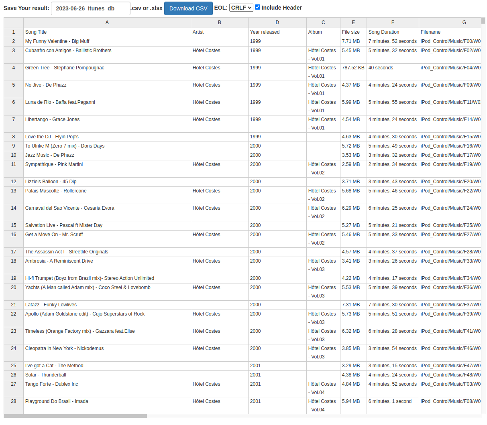
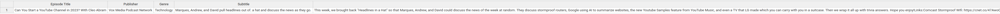
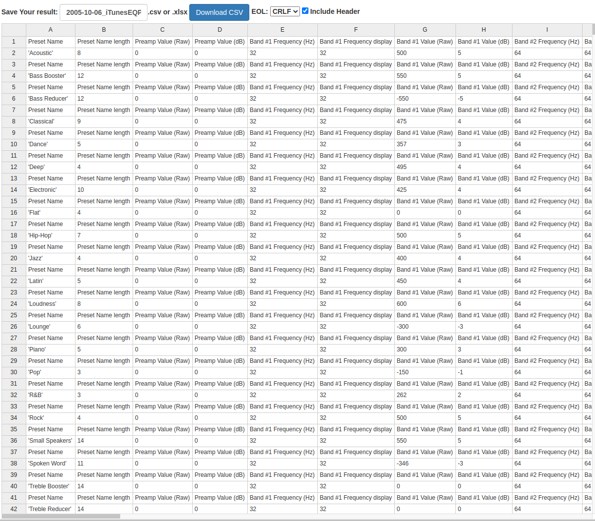

# Background

iPods store various information in what are called, "iTunesDB files". Despite the name, these are not "real" database (eg Postgres) files, but, instead binary files.

There are several types of iTunesDB files, but their purpose is mostly centered around storing information for what kind of media (photos, videos) is on that device, and information attached to that media.

(To add to the confusion, there is also a specific file itself called "iTunesDB".)

The format for iTunesDB files was reverse-engineered by the [iPod Linux](https://en.wikipedia.org/wiki/IPodLinux) team. The documentation for them is here: http://www.ipodlinux.org/ITunesDB

# About

This repository contains a parser/extractor for iTunesDB files, written in Rust. The parser is located in the `parser` directory.

The table below shows which iTunesDB files are supported.

| File type            | Supported?                                                       |
|----------------------|------------------------------------------------------------------|
| Artwork DB           | :negative_squared_cross_mark: Not yet supported                  |
| DeviceInfo           | Partial - Can extract iPod name only |
| Equalizer Presets    | :heavy_check_mark: Extracts both the iTunes and actual DSP  values |
| On The Go Playlist   | :negative_squared_cross_mark: Not yet supported                  |
| Photo Database       | :heavy_check_mark: Can extract all associated metadata of images |
| PhotoFolderAlbums    | Partial - only can detect the # of photo albums                  |
| PhotoFolderPrefs     | No support planned.                                              |
| PhotosFolderName     | :negative_squared_cross_mark: Not yet supported                  |
| Play Counts          | :heavy_check_mark:                                               |
| Preferences          | :heavy_check_mark:                                               |
| WABContactsGroup     | :negative_squared_cross_mark: Not yet supported                  |
| iEKInfo              | :negative_squared_cross_mark: Not yet supported                  |
| iTunesDB             | Partial - Songs and Podcasts only. No television or movies       |
| iTunesPState         | :negative_squared_cross_mark: Not yet supported                  |
| iTunesPlaylists      | :grey_question: [Not documented yet](http://www.ipodlinux.org/ITunesDB/#iTunesPlaylists) |
| iTunesPodcasts       | :grey_question: [Not documented yet](http://www.ipodlinux.org/ITunesDB/#iTunesPodcasts) |
| iTunesPrefs          | :heavy_check_mark:                                               |
| iTunesSD             | :heavy_check_mark:                                               |
| iTunesStats          | :negative_squared_cross_mark: Not yet supported                  |
| iTunesVideoPlaylists | :grey_question: [Not documented yet](http://www.ipodlinux.org/ITunesDB/#iTunesVideoPlaylists) |
| winPrefs             | :grey_question: [Not documented yet](http://www.ipodlinux.org/ITunesDB/#winPrefs_File) |


In examining your iPod's file system you'll find other types of files besides the one listed above. These are:

* [`.plist` files](https://en.wikipedia.org/wiki/Property_list)

* [`.tone` files](https://github.com/raleighlittles/iPod_tone_file_player)

* `alarms` files: https://github.com/raleighlittles/iTunesDB-Parser/issues/6

* `.itdb` files, which are just SQLite 3 databases with a different extension.

Because iPodLinux isn't maintained anymore, I was worried that the website (and thus the iTunesDB wiki) would be taken down at some point, so I downloaded the documentation.

Both the original website, and a markdown-formatted version are in the `itunesdb_docs` folder.

# Code and usage

The parser is written in Rust. You can build it by running `cargo build`.

It requires two arguments:

(1) the iTunesDB filename, 

(2) the type of iTunesDB file.

The 7 possible "type" options are:


| Field         | Value                                    |
|---------------|------------------------------------------|
| "photo"       | Photos Database files, no iThmb files    |
| "itunes"      | iTunes DB (music and podcasts only) file |
| "itprefs"     | iTunes Preferences file                  |
| "playcounts"  | Playcounts file                          |
| "pfalbums"    | Photo Folder Albums                      |
| "preferences" | Preferences file                         |
| "deviceinfo"  | DeviceInfo file                          |
| "equalizer"   | Equalizer Presets file                   |
| "itunessd"    | iTunesSD file                            |


```bash
$ /target/debug/itunesdb_parser <path-to-itunesdb-file> '<type>'
```

For iTunesDB, Photos Database, Equalizer files, and Playcounts files, a CSV will be generated with all the relevant information. For example, if you run it on an iTunesDB file, the output CSV will contain the info for all songs and podcasts mentioned in the iTunesDB file.





If you run it on a Photo Database file, you'll see the list of all images stored on that iPod.


Equalizer settings CSV: 

# Extras

There's 2 extra utilities that may be of use:


* Spotify integration: This creates a Spotify playlist out of the songs that were found on your iPod. See the README in that directory for more.

* Song renaming functionality: iPods (generally ?) store the song files on their hard drive, however, the filenames are usually just a generic unique ID. I wrote a Python script that lets you rename the songs to have the song title and artist name instead, using the data that is in the iTunesDB file. See the README in that directory for more information.

# Future roadmap

This project is a very early work-in-progress. The next major feature to come is [iThumb file decoding](https://github.com/raleighlittles/iTunesDB-Parser/issues/4)


# Interested in contributing?

If you have any iTunesDB files from the unsupported list and are willing to share, please contact me.

Special thanks to:

* @AZProductions 
* @joshkenney

for providing iTunesDB files!

<a href="https://www.buymeacoffee.com/raleighlittles" target="_blank"></a>