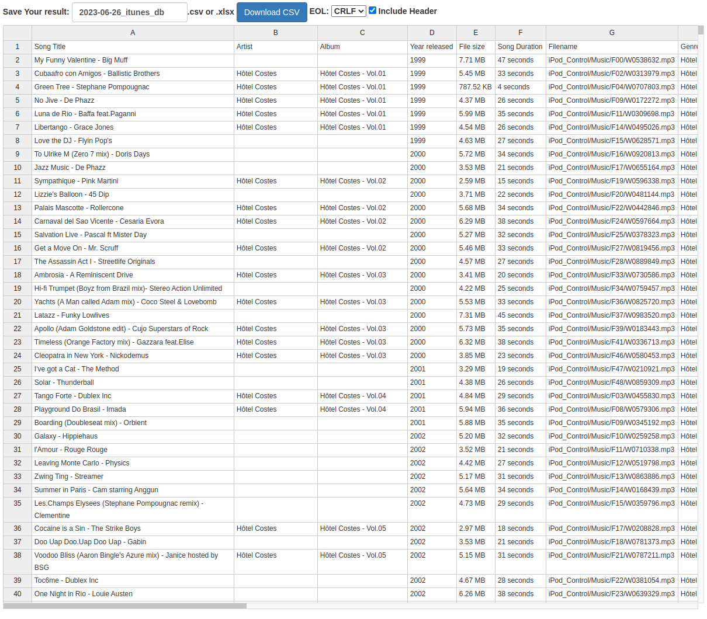
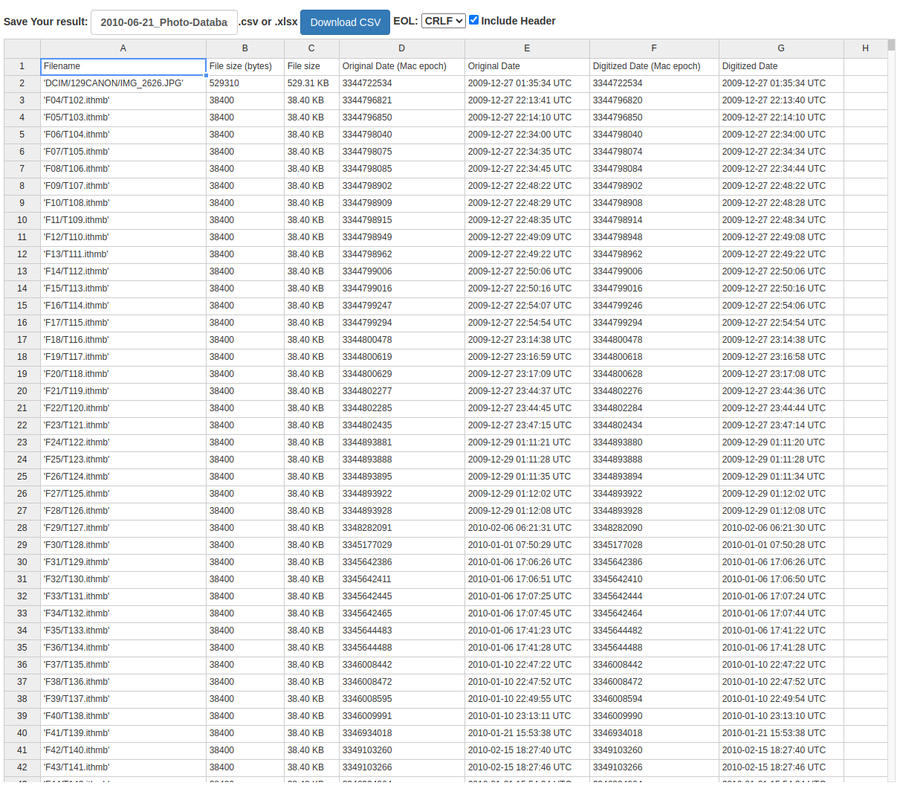

# Background

iPods store various information in what are called, "iTunesDB files". Despite the name, these are not "real" database (eg Postgres) files, but, instead binary files.

There are several types of iTunesDB files, but their purpose is mostly centered around storing information for what kind of media (photos, videos) is on that device, and information attached to that media.

(To add to the confusion, there is also a specific file itself called "iTunesDB".)

The format for iTunesDB files was reverse-engineered by the [iPod Linux](https://en.wikipedia.org/wiki/IPodLinux) team. The documentation for them is here: http://www.ipodlinux.org/ITunesDB

# About

This repository contains a parser/extractor for iTunesDB files, written in Rust.

Currently, two types of iTunesDB files are supported:

| File type            | Supported?                                                       |
|----------------------|------------------------------------------------------------------|
| iTunesDB             | Partial - songs/audio only (no podcasts, movies, etc.)           |
| Photo Database       | :heavy_check_mark: Can extract all associated metadata of images |
| Play Counts          | :negative_squared_cross_mark: Not yet supported                  |
| On The Go Playlist   | :negative_squared_cross_mark: Not yet supported                  |
| iTunesSD             | :negative_squared_cross_mark: Not yet supported                  |
| iTunesStats          | :negative_squared_cross_mark: Not yet supported                  |
| iTunesPrefs          | :negative_squared_cross_mark: Not yet supported                  |
| winPrefs             | :negative_squared_cross_mark: Not yet supported                  |
| DeviceInfo           | :negative_squared_cross_mark: Not yet supported                  |
| iEKInfo              | :negative_squared_cross_mark: Not yet supported                  |
| WABContactsGroup     | :negative_squared_cross_mark: Not yet supported                  |
| iTunesLock           | :negative_squared_cross_mark: Not yet supported                  |
| PhotosFolderName     | :negative_squared_cross_mark: Not yet supported                  |
| PhotoFolderPrefs     | :negative_squared_cross_mark: Not yet supported                  |
| PhotoFolderAlbums    | :negative_squared_cross_mark: Not yet supported                  |
| iTunesPlaylists      | :negative_squared_cross_mark: Not yet supported                  |
| iTunesPodcasts       | :negative_squared_cross_mark: Not yet supported                  |
| iTunesVideoPlaylists | :negative_squared_cross_mark: Not yet supported                  |
| Preferences          | :negative_squared_cross_mark: Not yet supported                  |


The source code for the parser is in the `itunesdb_parser` directory.

Because iPodLinux isn't maintained anymore, I was worried that the website (and thus the iTunesDB wiki) would be taken down at some point, so I downloaded the documentation. Both the original website HTML, and a markdown-formatted version are in the `itunesdb-doc` folder: [Link](./itunesdb-doc/README.md)

# Code

The parser is written in Rust. You can build it by running `cargo build`. It requires two arguments: (1) the iTunesDB filename, (2) the type of iTunesDB file - currently only "photo" (for Photo Database) and "music" (for iTunesDB) are supported

```bash
$ /target/debug/itunesdb_parser <path-to-itunesdb-file> '<type>'
```

Running this tool will create a CSV file with all the relevant information. For example, if you run it on an iTunesDB file, the output CSV will contain the info for all songs mentioned in the iTunesDB file.



If you run it on a Photo Database file, you'll see the list of all images stored on that iPod.



# Future roadmap & contributing

This project is a very early work-in-progress. At some point, I'd like to add support for the other database types. I don't have an iPod anymore, or any other files from it besides the Photos Database ones. If you have any iTunesDB files from the unsupported list and are willing to share, please open an issue. Special thanks to @AZProductions for providing an iTunesDB file.

